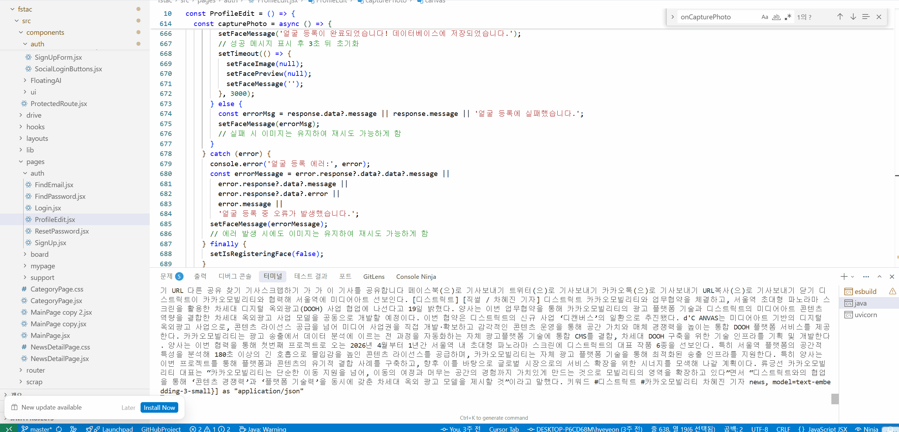
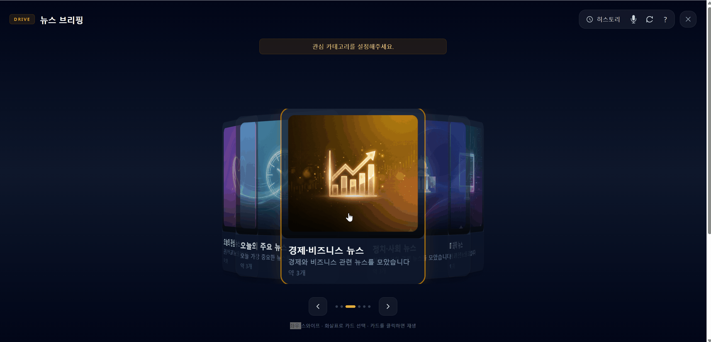
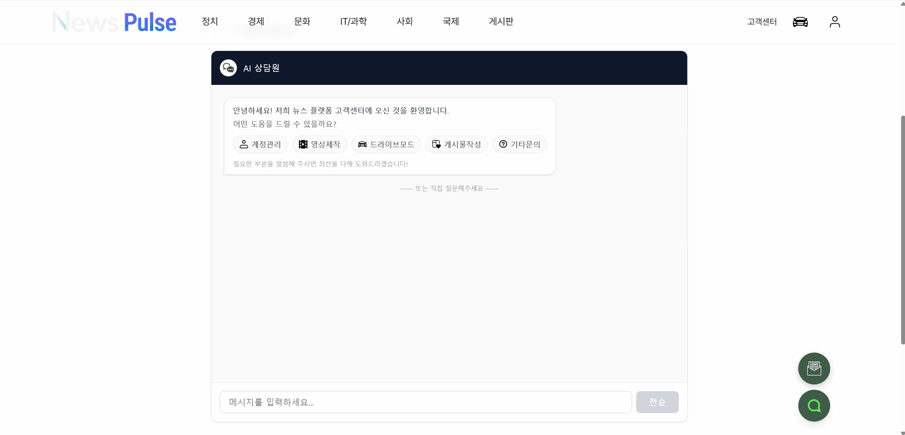
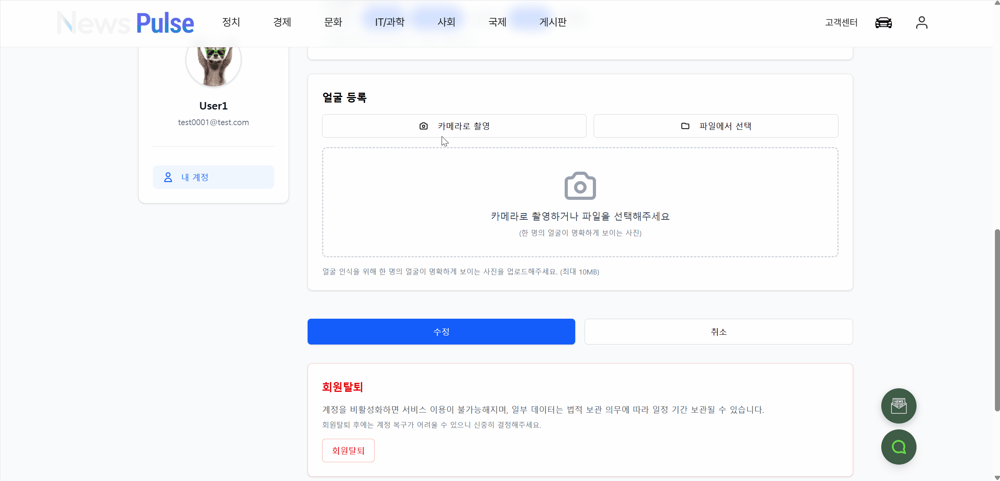

# 🗞️ News Pulse  
### AI 기반 뉴스 플랫폼

> **단순 뉴스 제공이 아닌, AI가 뉴스를 자동 수집·요약·영상 제작하는 차세대 뉴스 플랫폼**

## 📅 프로젝트 개요

| 항목 | 내용 |
|------|------|
| 프로젝트명 | News Pulse |
| 개발 기간 | 26.01.16 ~ 26.02.13 (4주) |

### 프로젝트 소개

**News Pulse**는 사용자가 매일 수많은 뉴스 중에서 중요한 정보를 빠르게 파악하는 데 어려움을 겪는 문제를 해결하기 위해 기획되었습니다.

기존 뉴스 플랫폼의 수동 탐색 한계를 넘어,  
**AI 자동 요약 + 영상 제작 + 음성 인터페이스 + 얼굴 인식** 기술을 결합하여  
자연스럽고 편리한 방식으로 뉴스를 소비할 수 있는 **지능형 뉴스 플랫폼**입니다.


## 참고 사이트
[네이버 뉴스](https://news.naver.com/)

[논문](https://www.tandfonline.com/doi/abs/10.1080/01972240490507974)

## 🔗 프로젝트 자료

### 📘 API 문서

👉 [노션 바로가기](https://www.notion.so/evve00/Full-Stack-2ed9bf07f8d080428d0ac37b2b2c3c7f)

👉 [영상 바로가기](https://youtu.be/D9-CwOcEv1w?si=bbBhQPHsbsgI2S9Z)

📄 발표 PDF: [다운로드](./files/1조_2차%20한해찬,%20강진수,%20성건우,%20전유진,%20문주연.pdf)

📄 AI PDF: [다운로드](./files/1조_AI%20PDF.pdf)

## 👨‍💻 팀 구성 및 역할 분담 (R&R)

|                                                             이름                                                             |                         GitHub                         | 주요 담당 기능                                                                                                                                                                                                                                                                                                                                                                                                                              |
| :------------------------------------------------------------------------------------------------------------------------: | :----------------------------------------------------: | :------------------------------------------------------------------------------------------------------------------------------------------------------------------------------------------------------------------------------------------------------------------------------------------------------------------------------------------------------------------------------------------------------------------------------------ |
|   [](https://github.com/Moonjooyeon)<br>**문주연 (팀장)**  |     [@Moonjooyeon](https://github.com/Moonjooyeon)     | 🔹 카테고리 별 뉴스(CRUD)<br>🔹 Naver API·RSS 기반 뉴스 데이터 수집 자동화 파이프라인 구축<br>🔹 Non-blocking 통신 및 타임아웃 최적화<br>🔹 **OpenAI 기반 뉴스 3단 구조 자동 요약 시스템 구현**<br>🔹 생성형 AI 썸네일 자동 생성 시스템<br>🔹 Java–Python 하이브리드 NLP 품질 평가 연동<br>🔹 외부 API 장애 대응 Fallback 이미지 및 비동기 복구 로직 구현<br>🔹 JSON–DB 매핑 무결성 관리, 트랜잭션·예외 처리 고도화<br>🔹 프로젝트 페이지 디자인 구성<br>🔹 PDF 제작 및 최종 발표 총괄   |
|      [](https://github.com/shanekang1)<br>**강진수**      |      [@shanekang1](https://github.com/shanekang1)      | 🔹 마이페이지(CRUD)<br>🔹 **AI 기반 뉴스 기사 요약 영상 제작**<br> 🔹 기사 제목을 AI로 분석하여 본문 핵심 내용 추출<br> 🔹 뉴스 기사 내용을 AI TTS(Text-to-Speech)로 음성 변환<br> 🔹 기사 핵심 키워드 자동 추출 및 이미지 매칭<br> 🔹 키워드 기반 이미지 소스 연동<br> 🔹 HuggingFace 이미지 활용 <br>🔹 Pollinations API 이미지 활용<br> 🔹 Pexels 이미지 활용|
|    [](https://github.com/parucho-1358)<br>**성건우**    |    [@parucho-1358](https://github.com/parucho-1358)    | 🔹 OpenAI GPT-4o-mini + Tavily Search API 기반 **웹 검색형 AI 챗봇** 구현<br>🔹 Signal.bz 실시간 트렌딩 키워드 연동<br>🔹 Java–Python 하이브리드 아키텍처 기반 FAQ 참조형 AI 상담 챗봇 구축 (On-Device HyperCLOVA)<br>🔹 JPA 기반 FAQ (CRUD) 및 키워드 검색<br>🔹 JPA Enum 기반 자유/토론 게시판 통합 설계<br>🔹 UniqueConstraint 기반 찬반 투표 시스템 구현<br>🔹 Multipart 다중 파일 첨부, 좋아요 토글, 댓글(CRUD)<br>🔹 AI PDF 제작 담당 |
| [](https://github.com/ujyj0414-dotcom)<br>**전유진** | [@ujyj0414-dotcom](https://github.com/ujyj0414-dotcom) | 🔹 Whisper / GPT-4o-mini 기반 **뉴스 음성 제어 시스템(STT)** 구현<br>🔹 음성 명령 히스토리 관리 (CRUD, JPA Dirty Checking, Multipart 전송)<br>🔹 Whisper + NLU 기반 자연어 뉴스 예약 및 메일 브리핑 자동화 파이프라인<br>🔹 @Scheduled 기반 뉴스 요약 PDF 생성 및 SMTP 발송<br>🔹 뉴스 스크랩 관리 기능 구현 (중복 방지 Cluster Key 적용)<br>🔹 CapCut 기반 시연 영상 제작  |
|      [](https://github.com/haechan419)<br>**한해찬**      |      [@haechan419](https://github.com/haechan419)      | 🔹 **JWT 기반 인증 시스템 구현**<br>🔹 OAuth2 소셜 로그인 연동 (카카오·네이버·구글)<br>🔹 자체 로그인 및 회원 관리 기능 구현 (CRUD)<br>🔹 **OpenAI 기반 얼굴 등록·얼굴 인식 로그인 구현**<br>🔹 **Redux 기반 인증(Auth) 상태 전역 관리**<br>🔹 프로필 수정 및 메인 페이지 UI 구현<br>🔹 외부 API·웹 크롤링 기반 환율·주가지수 데이터 수집<br>🔹 Redis 캐싱 적용 (환율·주가지수 5초 주기 조회)<br>🔹 카테고리별 뉴스 매칭 기능 구현<br>🔹 Tailwind CSS + shadcn/ui 기반 UI 리팩토링<br>🔹 Redux 기반 SPA 전역 상태 관리 및 화면 구성<br>🔹 프로젝트 통합 관리 및 GitHub 형상 관리<br>🔹 유스케이스 다이어그램, ERD, README.md 작성 |


## 🛠 기술 스택

### 🤖 AI / Data
- **LLM & AI**  
  OpenAI, LangChain, LangChain OpenAI  
- **Search / Crawling**  
  Tavily (Python), BeautifulSoup4  
- **Data Analysis & ML**  
  NumPy, Pandas, SciPy, Scikit-learn  
- **Finance Data**  
  FinanceDataReader, yfinance  
- **Visualization / Report**  
  Plotly, ReportLab  
- **Media / TTS**  
  edge-tts  

---

### 🐍 Python
- **Web Framework**  
  FastAPI, Uvicorn  
- **HTTP / Async**  
  HTTPX, Requests  
- **Environment / Validation**  
  python-dotenv, python-multipart, Pydantic  
- **Image / Video / QR**  
  Pillow, Thumbnailator, qrcode[pil], MoviePy  
- **Database**  
  PyMySQL, mysql-connector-python  
- **Parsing / Feed**  
  Jsoup, Rome, BeautifulSoup4  
- **Testing / Scheduling**  
  Pytest, Pytest-Asyncio, Schedule  

---

### ⚙️ Backend
- **Languages**  
  Java, Python  
- **Framework**  
  Spring Boot  
- **Security / Auth**  
  Spring Security, Spring OAuth2, JWT (0.11.5)  
- **Data Access**  
  JPA, JDBC, Redis  
- **Dev / Test**  
  Spring Boot DevTools, Spring Security Test, JUnit  
- **API / Serialization**  
  SpringDoc OpenAPI WebMVC UI, Jackson Databind, Gson  
- **Mapping**  
  ModelMapper  

---

### 🎨 Frontend
- **Core**  
  React, React DOM, Vite  
- **State / Routing**  
  Redux Toolkit, React Redux, React Router DOM  
- **HTTP**  
  Axios  
- **Styling**  
  Tailwind CSS, PostCSS, Autoprefixer  
- **UI / Utility**  
  Radix UI, clsx, tailwind-merge, class-variance-authority  
- **Markdown / Test / Metrics**  
  React Markdown, Vitest, jsdom, Web Vitals  

---

### 🧰 Tools / Database
- **Database / Cache**  
  MariaDB, Redis, H2, Caffeine  
- **IDE / Editor**  
  IntelliJ IDEA, VS Code, Cursor  
- **API / Docs**  
  Postman, Swagger  
- **Design / Build**  
  Figma, Lombok  
- **DB Tool**  
  MySQL Workbench  


## 📁 프로젝트 구조

```
GitHubProject/
├── fstac/          # 프론트엔드 (React + Vite)
│   ├── src/
│   │   ├── pages/          # 페이지 컴포넌트
│   │   ├── components/      # 재사용 컴포넌트
│   │   ├── api/            # API 클라이언트
│   │   ├── drive/          # 드라이브 모드
│   │   └── briefDelivery/  # 브리핑 배송
│   └── package.json
│
├── fullStc/        # 백엔드 (Spring Boot)
│   ├── src/main/java/com/fullStc/
│   │   ├── news/           # 뉴스 수집 및 처리
│   │   ├── ai/             # 영상 제작
│   │   ├── drive/          # 드라이브 모드
│   │   ├── support/        # 고객센터
│   │   ├── member/         # 사용자 관리
│   │   └── security/       # 인증/인가
│   └── build.gradle
│
└── python-ai/      # AI 서버 (FastAPI)
    ├── main.py             # 메인 서버
    ├── drive/              # 드라이브 모드 AI
    ├── brief_delivery/     # 브리핑 배송 AI
    ├── video_worker.py     # 영상 제작 엔진
    ├── media_tools.py      # 미디어 처리
    ├── quality_check.py    # 품질 검사
    └── requirements.txt
```

## 🗂 ERD


## 🏗 Use Case Diagram


## 🏛 System Architecture


## 📱 반응형 UI


## ✨ 핵심 기능

| CMD | Workbench |
|:-----------------------------------------:|:-----------------------------------------:|
|  |  |

### ① 뉴스 요약 AI 파이프라인

#### 자동 뉴스 수집 및 요약
- Naver News API + Google RSS 수집
- OpenAI Embedding 기반 클러스터링
- 코사인 유사도로 유사 뉴스 그룹화
- LLM 기반 대표 요약 생성
- Unsplash API 이미지 자동 생성

**처리 순서**:
1. 데이터 수집 (Naver News API, Google RSS)
2. 임베딩 생성 (OpenAI `text-embedding-3-small`)
3. 클러스터링 + 품질검사 (코사인 유사도 계산)
4. 대표 요약 생성 (LLM) + 이미지 생성
5. DB 저장

---
| 메인페이지(Hot 영상) | 영상 제작 |
|:-----------------------------------------:|:-----------------------------------------:|
|  |  |
### ② 영상 제작 AI

#### 뉴스 기반 자동 영상 생성
- GPT-4o-mini 스토리보드 자동 생성
- OpenAI TTS 음성 합성
- Unsplash API 이미지 생성
- 자막 자동 생성 및 합성
- 16:9 / 9:16 비율 지원

**모듈 위치**: `python-ai/video_worker.py`, `python-ai/media_tools.py`

---

| 드라이브 모드 |
|:-----------------------------------------:|
|  |
### ③ 드라이브 모드 AI

#### 운전 중 음성 명령 뉴스 재생
- STT: 음성 → 텍스트 변환
- 의도 분석: GPT-4o-mini로 명령 의도 파악
- 브리핑 생성: 뉴스 큐 기반 DJ 스타일 브리핑
- TTS: 브리핑 음성 합성
- 플레이리스트: 뉴스 재생 관리

**모듈 위치**: `python-ai/drive/` 폴더

---
| AI비서 | 고객센터 챗봇 |
|:-----------------------------------------:|:-----------------------------------------:|
|  |  |
### ④ AI 비서 & 고객센터 챗봇

#### 실시간 검색 기반 챗봇
- Tavily API 웹 검색 연동
- 실시간 검색어 트렌딩
- FAQ 기반 고객 지원
- 대화 히스토리 관리

**모듈 위치**: `python-ai/main.py` (`/chat`, `/qa`)

---
| 브리핑 배송 AI |
|:-----------------------------------------:|
|  |
### ⑤ 브리핑 배송 AI

#### 예약 기반 뉴스 브리핑 PDF 생성
- NLU 기반 의도 분석 및 배송 시간 추출
- ReportLab PDF 자동 생성
- QR 코드 포함

**모듈 위치**: `python-ai/brief_delivery/` 폴더

---
| 얼굴 등록 | 얼굴 인식 |
|:-----------------------------------------:|:-----------------------------------------:|
|  |  |

### ⑥ 얼굴 인식 AI

#### OpenAI Vision API 기반 얼굴 인식
- 얼굴 등록 및 저장
- 얼굴 인식 및 매칭
- 사용자 정보 조회

**모듈 위치**: `python-ai/main.py` (`/face/register`, `/face/recognize`)

---
| 실시간 금융 데이터 |
|:-----------------------------------------:|
|  |

### ⑦ 금융 정보 서비스

#### 실시간 금융 데이터
- 환율 조회 (공공데이터 API + 크롤링)
- 주가지수 조회 (KOSPI, KOSDAQ)
- 실시간 검색어 트렌딩


## 🔧 AI 공통 처리 파이프라인

모든 AI 기능은 다음 공통 파이프라인을 따릅니다:

1. **입력 검증 및 전처리** - 데이터 형식 검증, 텍스트 정규화
2. **캐시 확인** - MD5 해시 기반 캐시 조회 (API 호출 최소화)
3. **AI API 호출** - 캐시 미스 시 LLM/Vision API 호출
4. **결과 후처리** - 응답 형식 변환, 신뢰도 계산
5. **캐시 저장** - 성공 결과 캐시 저장
6. **에러 처리** - 기본값 반환, 서비스 지속성 유지


## 🚀 시작하기

### 사전 요구사항
- Node.js (v18 이상)
- Java 21
- Python 3.11.9
- MariaDB
- Redis (선택사항)

### 환경 변수 설정

#### Backend (`fullStc/`)
```yaml
spring:
  datasource:
    url: jdbc:mariadb://localhost:3306/your_database
    username: your_username
    password: your_password
  
openai:
  api:
    key: your_openai_api_key

naver:
  client-id: your_naver_client_id
  client-secret: your_naver_client_secret
```

#### AI Server (`python-ai/`)
```env
OPENAI_API_KEY=your_openai_api_key
DB_HOST=localhost
DB_USER=your_db_user
DB_PASS=your_db_password
DB_NAME=your_database
IMAGEMAGICK_PATH=C:/path/to/ImageMagick/bin/magick.exe
TAVILY_API_KEY=your_tavily_api_key
```

### 실행 순서

#### 1. AI 서버 실행
```bash
cd python-ai
python -m venv venv
source venv/Scripts/activate
cd ../../
pip install -r requirements.txt
uvicorn main:app --reload
```

#### 2. 백엔드 실행
```bash
cd fullStc
# cmd
gradlew bootRun
# 또는 Windows
gradlew.bat bootRun
```

#### 3. 프론트엔드 실행
```bash
cd fstac
npm install
npm run dev
```

---


## 📁 모듈별 기능 위치

### python-ai 모듈
- **뉴스 요약 AI**: `quality_check.py`
- **영상 제작 AI**: `video_worker.py`, `media_tools.py`
- **AI비서/챗봇**: `main.py` (`/chat`, `/qa`)
- **드라이브 모드 AI**: `drive/` 폴더
- **브리핑 배송 AI**: `brief_delivery/` 폴더
- **얼굴 인식 AI**: `main.py` (`/face/register`, `/face/recognize`)

## 🔧 개발 가이드

### 규칙 기반 vs AI 판단 기준

**규칙 기반 처리**
- 단순 제어 명령 (재생, 일시정지 등)
- 데이터 검증 및 필터링
- 에러 처리 및 폴백

**AI 판단 처리**
- 의미 이해 및 생성 작업
- 맥락 기반 판단
- 자연어 처리

### AI 책임 범위
- **담당**: 의미 이해, 텍스트 생성, 이미지/음성 분석
- **비담당**: 단순 제어, 안정성 보장, 비즈니스 규칙 검증
- **실패 시**: 기본값 반환, 명확한 에러 메시지, 서비스 지속성 유지

## 📝 프로젝트 회고 (Retrospective)
✅ 잘한 점

외부 뉴스 기사를 수집한 뒤 요약 처리 및 **영상 콘텐츠로 자동 변환**하는 기능을 구현하였다.
이를 통해 사용자는 원문 기사를 직접 읽지 않아도 핵심 내용을 영상으로 빠르게 소비할 수 있으며,
텍스트 기반 뉴스 소비의 진입 장벽을 낮추는 **사용자 경험(UX)** 을 제공하였다.

사용자가 직접 타이핑을 하지 않아도 **얼굴 인식**을 통한 간편 로그인 기능을 구현하여
로그인 과정의 번거로움을 줄이고 접근성과 편의성을 향상시킨 점도 주요 성과로 평가된다.

--- 

⚠️ 아쉬운 점

개발 기간이 제한적이어서 **영상 편집 및 연출 측면의 퀄리티**를 충분히 고도화하지 못한 점이 아쉬움으로 남았다.
추가적인 시간이 있었다면 영상 이미지 구성, 전환 효과, 자막 타이밍, 음성 자연스러움 등을 개선하여
영상 완성도를 한 단계 더 높일 수 있었을 것으로 판단된다.

초기 GitHub 협업 규칙에서 팀원별 담당 페이지를 명확히 구분하기로 했으나,
기능 구현 과정에서 다른 팀원이 동일 페이지의 CSS 및 기능을 수정하면서
통합 과정에서 **충돌과 조율**의 어려움을 겪었다.
사전에 **협업 범위와 수정 규칙**을 충분히 조율하지 못한 점이 아쉬운 부분이었다.

--- 

🔧 보완이 필요한 점 및 향후 계획

해외 뉴스 기사까지 확장하는 기능을 목표로 했으나,
**언어 처리 및 번역 파이프라인 구현의 한계**로 인해
국내 뉴스 위주로만 제공된 점이 아쉬웠다.

구독 시스템을 도입하여 구독한 사용자만 뉴스 기사를 기반으로 직접 영상을 제작할 수 있는 기능을 기획했으나,
시간적 제약으로 인해 해당 기능을 구현하지 못한 점이 한계로 남았다.
향후에는 사용자 권한에 따른 기능 접근 제어와 구독 기반 서비스 구조를 도입하여
차별화된 사용자 경험을 제공할 계획이다.

프로젝트 통합 및 팀원 지원에 많은 시간을 할애하면서
전 세계 모든 화폐 및 주가 지수를 전부 연동하지 못한 점도 아쉬움으로 남았다.
향후에는 **다국어 뉴스 요약 및 영상화 기능과 함께
글로벌 금융 데이터**까지 확장하여 서비스 범위를 넓힐 계획이다.

--- 

📌 회고 요약

- **기술적 성과**: AI 뉴스 요약·영상화·음성·얼굴 인식까지 통합 구현

- **협업 인사이트**: 역할 분리와 수정 범위 사전 합의의 중요성 인식

- **확장 방향**: 구독 기반 서비스, 글로벌 뉴스·금융 데이터 확장

## ✅ 요약

> **News Pulse는 AI + 자동화를 결합한 실제 뉴스 소비 혁신 플랫폼입니다.**

- 자연어 기반 뉴스 소비
- 자동 요약 + 영상 제작
- 음성 인터페이스 (드라이브 모드)
- 실시간 검색 기반 챗봇
- 얼굴 인식 보안까지 통합 구현

---

