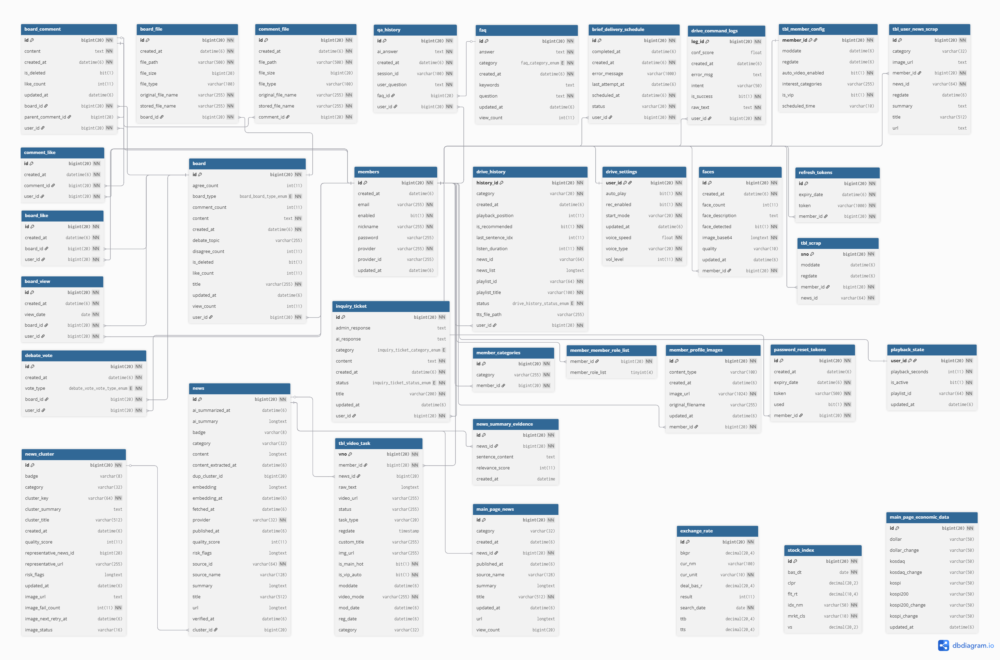
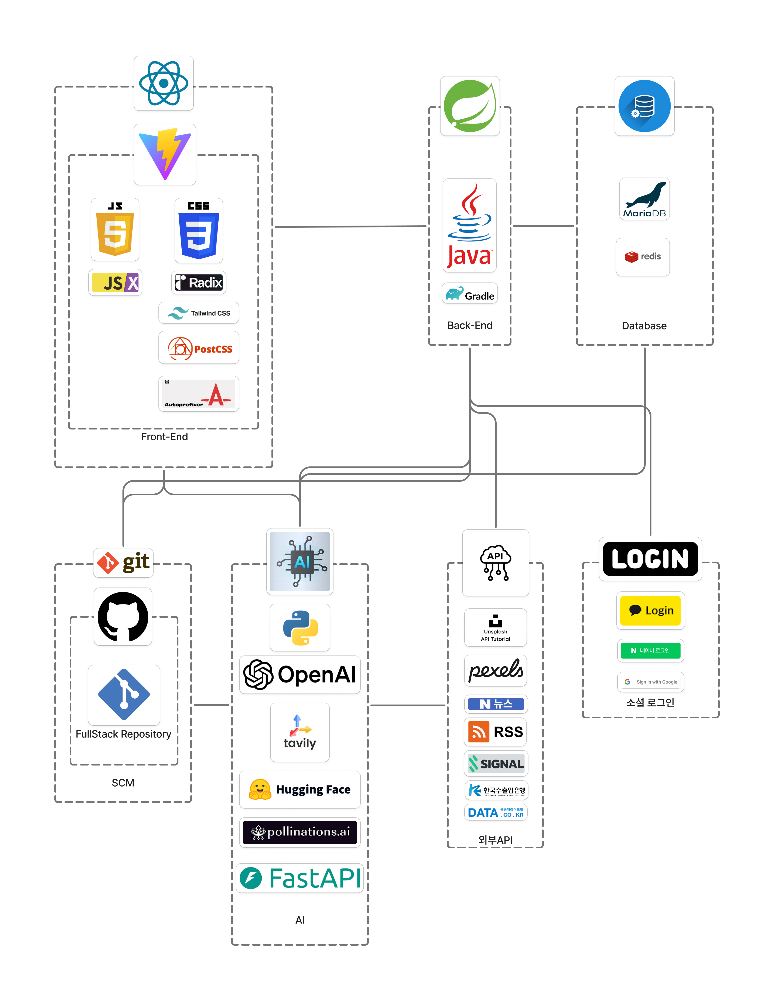

# 🗞️ News Pulse  
### AI 기반 뉴스 플랫폼

> **단순 뉴스 제공이 아닌, AI가 뉴스를 자동 수집·요약·영상 제작하는 차세대 뉴스 플랫폼**

## 📅 프로젝트 개요

| 항목 | 내용 |
|------|------|
| 프로젝트명 | News Pulse |
| 개발 기간 | 26.01.16 ~ 26.02.19 (5주) |

### 프로젝트 소개

**News Pulse**는 사용자가 매일 수많은 뉴스 중에서 중요한 정보를 빠르게 파악하는 데 어려움을 겪는 문제를 해결하기 위해 기획되었습니다.

기존 뉴스 플랫폼의 수동 탐색 한계를 넘어,  
**AI 자동 요약 + 영상 제작 + 음성 인터페이스 + 얼굴 인식** 기술을 결합하여  
자연스럽고 편리한 방식으로 뉴스를 소비할 수 있는 **지능형 뉴스 플랫폼**입니다.


## 참고 사이트
[네이버 뉴스](https://news.naver.com/)

[논문](https://www.tandfonline.com/doi/abs/10.1080/01972240490507974)

## 🔗 프로젝트 자료

### 📘 API 문서

👉 [노션 바로가기](https://www.notion.so/evve00/Full-Stack-2ed9bf07f8d080428d0ac37b2b2c3c7f)

👉 [영상 바로가기](https://youtu.be/D9-CwOcEv1w?si=bbBhQPHsbsgI2S9Z)

📄 발표 PDF: [다운로드](./files/team_1_pdf.pdf)

## 👥 팀 구성 (Team 1)

| 문주연(팀장) | 강진수  | 성건우 | 전유진 | 한해찬 |
|:--:|:--:|:--:|:--:|:--:|
|  |   |  |  |   |

## 📝 역할 분담 (R&R)

### 👤 문주연 (팀장)
- Naver API·RSS 기반 뉴스 데이터 수집 자동화 파이프라인 구축
- Non-blocking 통신 및 타임아웃 최적화
- OpenAI 기반 뉴스 3단 구조 자동 요약 시스템 구현
- 생성형 AI 썸네일 자동 생성 시스템
- Java–Python 하이브리드 NLP 품질 평가 연동
- 외부 API 장애 대응 이미지 Fallback 및 비동기 복구 로직 구현
- JSON-DB 매핑 무결성 관리, 트랜잭션·예외 처리 고도화 및 시스템 안정화 리팩토링
- 프로젝트 페이지 디자인 구성
- pdf 제작 및 발표

---

### 👤 강진수
- Layout 구현, 알림 기능 개발
- 비품 페이지 및 승인/신청 구현(CRUD), 장바구니(CRUD), fast-api.js를 활용한 얼굴 인식
- 프로젝트 구현 영상제작

---

### 👤 성건우
 - OpenAI GPT-4o-mini + Tavily Search API 웹 검색 기반 AI 챗봇 구현
 - Signal.bz 실시간 트렌딩 키워드
 - Java–Python 하이브리드 아키텍처 기반 FAQ 참조형 (On-Device HyperCLOVA) AI 상담 챗봇 구축
 - JPA FAQ CRUD·키워드 검색 
 - JPA Enum 기반 자유/토론 게시판 통합 설계
 - UniqueConstraint 찬성·반대 투표 시스템
 - Multipart 다중 파일 첨부·좋아요 토글·댓글 CRUD
 - AI PDF 제작

---

### 👤 전유진
- Whisper/GPT-4o-mini 기반 뉴스 음성 제어·히스토리 관리 시스템 (STT, CRUD, JPA Dirty Checking, Multipart 전송)
- Whisper/NLU 기반 자연어 뉴스 예약·메일 브리핑 자동화 파이프라인 (@Scheduled, Service Chaining, In-memory PDF, SMTP 발송)
- 뉴스 스크랩 관리 및 CapCut 기반 시연 영상 제작 기반 기술 커뮤니케이션 제작 (Scrap CRUD, Cluster Key 중복 방지)
- 시연 영상 제작

---

### 👤 한해찬
- JWT 기반 인증 시스템 구현
- OAuth2 소셜 로그인 연동(카카오, 네이버, 구글)
- 자체 로그인 기능 구현(회원 CRUD)
- OpenAI를 활용한 얼굴 등록 및 얼굴 인식 로그인 기능 구현
- Redux를 활용한 인증(Auth) 상태 전역 관리
- 프로필 수정 화면 구현
- 메인 페이지 UI 구현
- 외부 API 및 웹 크롤링을 활용한 환율, 주가지수 데이터 수집
- Redis를 활용하여 환율,주가지수 데이터 5초 주기 조회 및 캐싱 처리
- 카테고리별 뉴스 매칭 기능 구현
- Tailwind CSS + shadcn/ui 기반 UI 리팩토링
- Redux를 활용한 SPA구조의 전역 상태 관리 및 화면 구성
- 프로젝트 통합 관리 및 GitHub 형상 관리
- 유스케이스 다이어그램, ERD, README.md 제작


## 🛠 기술 스택

### 🤖 AI / Data
- **LLM & AI**  
  OpenAI, LangChain, LangChain OpenAI  
- **Search / Crawling**  
  Tavily (Python), BeautifulSoup4  
- **Data Analysis & ML**  
  NumPy, Pandas, SciPy, Scikit-learn  
- **Finance Data**  
  FinanceDataReader, yfinance  
- **Visualization / Report**  
  Plotly, ReportLab  
- **Media / TTS**  
  edge-tts  

---

### 🐍 Python
- **Web Framework**  
  FastAPI, Uvicorn  
- **HTTP / Async**  
  HTTPX, Requests  
- **Environment / Validation**  
  python-dotenv, python-multipart, Pydantic  
- **Image / Video / QR**  
  Pillow, Thumbnailator, qrcode[pil], MoviePy  
- **Database**  
  PyMySQL, mysql-connector-python  
- **Parsing / Feed**  
  Jsoup, Rome, BeautifulSoup4  
- **Testing / Scheduling**  
  Pytest, Pytest-Asyncio, Schedule  

---

### ⚙️ Backend
- **Languages**  
  Java, Python  
- **Framework**  
  Spring Boot  
- **Security / Auth**  
  Spring Security, Spring OAuth2, JWT (0.11.5)  
- **Data Access**  
  JPA, JDBC, Redis  
- **Dev / Test**  
  Spring Boot DevTools, Spring Security Test, JUnit  
- **API / Serialization**  
  SpringDoc OpenAPI WebMVC UI, Jackson Databind, Gson  
- **Mapping**  
  ModelMapper  

---

### 🎨 Frontend
- **Core**  
  React, React DOM, Vite  
- **State / Routing**  
  Redux Toolkit, React Redux, React Router DOM  
- **HTTP**  
  Axios  
- **Styling**  
  Tailwind CSS, PostCSS, Autoprefixer  
- **UI / Utility**  
  Radix UI, clsx, tailwind-merge, class-variance-authority  
- **Markdown / Test / Metrics**  
  React Markdown, Vitest, jsdom, Web Vitals  

---

### 🧰 Tools / Database
- **Database / Cache**  
  MariaDB, Redis, H2, Caffeine  
- **IDE / Editor**  
  IntelliJ IDEA, VS Code, Cursor  
- **API / Docs**  
  Postman, Swagger  
- **Design / Build**  
  Figma, Lombok  
- **DB Tool**  
  MySQL Workbench  


## 📁 프로젝트 구조

```
GitHubProject/
├── fstac/          # 프론트엔드 (React + Vite)
│   ├── src/
│   │   ├── pages/          # 페이지 컴포넌트
│   │   ├── components/      # 재사용 컴포넌트
│   │   ├── api/            # API 클라이언트
│   │   ├── drive/          # 드라이브 모드
│   │   └── briefDelivery/  # 브리핑 배송
│   └── package.json
│
├── fullStc/        # 백엔드 (Spring Boot)
│   ├── src/main/java/com/fullStc/
│   │   ├── news/           # 뉴스 수집 및 처리
│   │   ├── ai/             # 영상 제작
│   │   ├── drive/          # 드라이브 모드
│   │   ├── support/        # 고객센터
│   │   ├── member/         # 사용자 관리
│   │   └── security/       # 인증/인가
│   └── build.gradle
│
└── python-ai/      # AI 서버 (FastAPI)
    ├── main.py             # 메인 서버
    ├── drive/              # 드라이브 모드 AI
    ├── brief_delivery/     # 브리핑 배송 AI
    ├── video_worker.py     # 영상 제작 엔진
    ├── media_tools.py      # 미디어 처리
    ├── quality_check.py    # 품질 검사
    └── requirements.txt
```

## 🗂 ERD


## 🏗 Use Case Diagram


## 🏛 System Architecture


## 📱 반응형 UI


## ✨ 핵심 기능

### ① 뉴스 요약 AI 파이프라인

#### 자동 뉴스 수집 및 요약
- Naver News API + Google RSS 수집
- OpenAI Embedding 기반 클러스터링
- 코사인 유사도로 유사 뉴스 그룹화
- LLM 기반 대표 요약 생성
- Unsplash API 이미지 자동 생성

**처리 순서**:
1. 데이터 수집 (Naver News API, Google RSS)
2. 임베딩 생성 (OpenAI `text-embedding-3-small`)
3. 클러스터링 + 품질검사 (코사인 유사도 계산)
4. 대표 요약 생성 (LLM) + 이미지 생성
5. DB 저장

---

### ② 영상 제작 AI

#### 뉴스 기반 자동 영상 생성
- GPT-4o-mini 스토리보드 자동 생성
- OpenAI TTS 음성 합성
- Unsplash API 이미지 생성
- 자막 자동 생성 및 합성
- 16:9 / 9:16 비율 지원

**모듈 위치**: `python-ai/video_worker.py`, `python-ai/media_tools.py`

---

### ③ 드라이브 모드 AI

#### 운전 중 음성 명령 뉴스 재생
- STT: 음성 → 텍스트 변환
- 의도 분석: GPT-4o-mini로 명령 의도 파악
- 브리핑 생성: 뉴스 큐 기반 DJ 스타일 브리핑
- TTS: 브리핑 음성 합성
- 플레이리스트: 뉴스 재생 관리

**모듈 위치**: `python-ai/drive/` 폴더

---

### ④ AI 비서 & 고객센터 챗봇

#### 실시간 검색 기반 챗봇
- Tavily API 웹 검색 연동
- 실시간 검색어 트렌딩
- FAQ 기반 고객 지원
- 대화 히스토리 관리

**모듈 위치**: `python-ai/main.py` (`/chat`, `/qa`)

---

### ⑤ 브리핑 배송 AI

#### 예약 기반 뉴스 브리핑 PDF 생성
- NLU 기반 의도 분석 및 배송 시간 추출
- ReportLab PDF 자동 생성
- QR 코드 포함

**모듈 위치**: `python-ai/brief_delivery/` 폴더

---

### ⑥ 얼굴 인식 AI

#### OpenAI Vision API 기반 얼굴 인식
- 얼굴 등록 및 저장
- 얼굴 인식 및 매칭
- 사용자 정보 조회

**모듈 위치**: `python-ai/main.py` (`/face/register`, `/face/recognize`)

---

### ⑦ 금융 정보 서비스

#### 실시간 금융 데이터
- 환율 조회 (공공데이터 API + 크롤링)
- 주가지수 조회 (KOSPI, KOSDAQ)
- 실시간 검색어 트렌딩


## 🔧 AI 공통 처리 파이프라인

모든 AI 기능은 다음 공통 파이프라인을 따릅니다:

1. **입력 검증 및 전처리** - 데이터 형식 검증, 텍스트 정규화
2. **캐시 확인** - MD5 해시 기반 캐시 조회 (API 호출 최소화)
3. **AI API 호출** - 캐시 미스 시 LLM/Vision API 호출
4. **결과 후처리** - 응답 형식 변환, 신뢰도 계산
5. **캐시 저장** - 성공 결과 캐시 저장
6. **에러 처리** - 기본값 반환, 서비스 지속성 유지


## 🚀 시작하기

### 사전 요구사항
- Node.js (v18 이상)
- Java 21
- Python 3.11.9
- MariaDB
- Redis (선택사항)

### 환경 변수 설정

#### Backend (`fullStc/`)
```yaml
spring:
  datasource:
    url: jdbc:mariadb://localhost:3306/your_database
    username: your_username
    password: your_password
  
openai:
  api:
    key: your_openai_api_key

naver:
  client-id: your_naver_client_id
  client-secret: your_naver_client_secret
```

#### AI Server (`python-ai/`)
```env
OPENAI_API_KEY=your_openai_api_key
DB_HOST=localhost
DB_USER=your_db_user
DB_PASS=your_db_password
DB_NAME=your_database
IMAGEMAGICK_PATH=C:/path/to/ImageMagick/bin/magick.exe
TAVILY_API_KEY=your_tavily_api_key
```

### 실행 순서

#### 1. AI 서버 실행
```bash
cd python-ai
python -m venv venv
source venv/Scripts/activate
cd ../../
pip install -r requirements.txt
uvicorn main:app --reload
```

#### 2. 백엔드 실행
```bash
cd fullStc
# cmd
gradlew bootRun
# 또는 Windows
gradlew.bat bootRun
```

#### 3. 프론트엔드 실행
```bash
cd fstac
npm install
npm run dev
```

---


## 📁 모듈별 기능 위치

### python-ai 모듈
- **뉴스 요약 AI**: `quality_check.py`
- **영상 제작 AI**: `video_worker.py`, `media_tools.py`
- **AI비서/챗봇**: `main.py` (`/chat`, `/qa`)
- **드라이브 모드 AI**: `drive/` 폴더
- **브리핑 배송 AI**: `brief_delivery/` 폴더
- **얼굴 인식 AI**: `main.py` (`/face/register`, `/face/recognize`)

## 🔧 개발 가이드

### 규칙 기반 vs AI 판단 기준

**규칙 기반 처리**
- 단순 제어 명령 (재생, 일시정지 등)
- 데이터 검증 및 필터링
- 에러 처리 및 폴백

**AI 판단 처리**
- 의미 이해 및 생성 작업
- 맥락 기반 판단
- 자연어 처리

### AI 책임 범위
- **담당**: 의미 이해, 텍스트 생성, 이미지/음성 분석
- **비담당**: 단순 제어, 안정성 보장, 비즈니스 규칙 검증
- **실패 시**: 기본값 반환, 명확한 에러 메시지, 서비스 지속성 유지

## ✅ 요약

> **News Pulse는 AI + 자동화를 결합한 실제 뉴스 소비 혁신 플랫폼입니다.**

- 자연어 기반 뉴스 소비
- 자동 요약 + 영상 제작
- 음성 인터페이스 (드라이브 모드)
- 실시간 검색 기반 챗봇
- 얼굴 인식 보안까지 통합 구현

---
